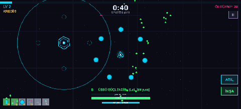

# Unity MCP Bridge


> *A complete game UI assembled from scratch through these tools — panels, buttons, dropdowns and scroll views placed one by one, then every controller reference wired automatically. Real time: under a minute.*

Drive the Unity Editor from **Claude Code**, **Cursor**, **Windsurf**, **Antigravity** or any MCP client: see the scene, create/move/delete objects, edit components and their properties, place prefabs, write C# scripts and fix their compile errors, control **Play mode**, and build **tilemaps**, **animations**, **blend trees**, **particle systems** and **terrains** — all from natural language. **No API key, no account, no Python** — one C# file plus Node, working with your existing subscription.

### Built for low token cost

An agent pays for every token it reads, and a careless Unity bridge burns them fast — 50 tool schemas at startup, a full scene dump to find one object, the same exception repeated 200 times in a console read. This one is built the other way round:

| | |
|---|---|
| **Load only the tools you need** | `UNITY_MCP_TOOLS=core` exposes 19 tools instead of 52 — **~3.1k tokens instead of ~8.8k**, every session |
| **Read the console incrementally** | Pass the previous `cursor` back as `since` and get only what is new; identical repeats collapse into one entry with a `count` |
| **Build scenes in one call** | `unity_create_objects` creates many objects per round trip, with shared defaults and per-item overrides |
| **Screenshot only what you need** | `isolate:"Enemy/Sprite"` renders one object alone instead of a full frame you have to squint at |
| **Guidance every client receives** | Usage rules ship in the MCP `instructions` field, so no per-editor rules file is needed |

> Compatible with **Unity 6.2+ (EntityId API)** as well as older versions — see [Unity version compatibility](#unity-version-compatibility).

**Languages:** [English](#english) · [Türkçe](#türkçe)

---

## English

### Why this exists

Describe what you want in plain language and an AI agent builds it inside Unity — laying out UI, wiring components, generating scripts and fixing their compile errors, arranging 2D levels, and **verifying the result visually via screenshots the model can actually see.** Work that takes hours by hand often takes minutes.

### Guidance for AI agents

The server sends a usage guide in the MCP `instructions` field on `initialize`,
so **every** client receives it — Claude Code, Cursor, Windsurf, Cline,
Antigravity — without any per-editor rules file.

[`AGENTS.md`](AGENTS.md) repeats the same guidance for clients that ignore that
field. The short version:

- **Screenshots are for visual checks only** (~2k tokens each). To verify logic
  or numbers, have an editor script write `Logs/report.txt` and read the file —
  cheaper and exact.
- **Pick the right screenshot source.** While playing, `source:"screen"` reads
  the Game View image as-is — post-processing and overlay UI exactly as the
  player sees them, and nothing in the scene is touched. Checking a single
  sprite or prefab? `isolate:"Hierarchy/Path"` renders that object alone, which
  is far cheaper and clearer than a full frame.
- **Read the console incrementally:** pass the `cursor` from the previous
  `unity_read_console` call back as `since` to get only new entries. Repeated
  identical messages are collapsed into one entry with a `count`, so a
  per-frame exception no longer floods the result.
- **Create scenes in one call:** `unity_create_objects` builds many objects at
  once, with shared defaults and per-item overrides.
- **Check `unity_get_play_state` before `unity_play`** — calling play while
  already playing toggles the mode.
- **Never compile while in play mode.** Unity domain-reloads: statics reset but
  `Awake` is not called again, so singletons and pools become `null` with no
  compile error. Make managers resolve lazily to survive it.
- **Bound every loop in editor scripts** — the bridge runs on Unity's main
  thread, so an infinite loop freezes the editor and times out every tool call.
- Expose debug actions as `[MenuItem]` entries: they give an agent deterministic
  control over runtime state, since the bridge cannot simulate input.


### Architecture

```
Claude Code / Antigravity  ─MCP(stdio)→  server.js  ─TCP:6400→  Unity Editor (McpBridge.cs)
```

- `McpBridge.cs` runs inside the Unity Editor and listens on `127.0.0.1:6400`, executing commands on the main thread (Undo-aware).
- `server.js` is a Node MCP server that exposes `unity_*` tools and forwards them to Unity over TCP.

### Requirements

- **Unity 2021.2+** (tested up to **Unity 6.x**). Prefab-mode APIs need 2021.2+.
- **Node.js 18+**
- The **Newtonsoft JSON** package (`com.unity.nuget.newtonsoft-json`) — pulled in automatically when you install via UPM.

### Installation

#### 1) Unity side — one line

**Window > Package Manager > + > Add package from git URL:**

```
https://github.com/canakbass/unity-mcp.git?path=/UnityPackage
```

Newtonsoft JSON is pulled in automatically as a dependency. When it compiles the
Console shows `[MCP Bridge] Listening on 127.0.0.1:6400`.

*(Pin a version with `#v5.0.0`. Prefer not to use UPM? Copy `UnityPackage/Editor/McpBridge.cs` to `Assets/Editor/` and install `com.unity.nuget.newtonsoft-json` yourself.)*

#### 2) Server and client config — one window

```bash
git clone https://github.com/canakbass/unity-mcp.git
```

Then in Unity open **Tools > MCP Bridge > Setup...** and use the three buttons:

1. **server.js** — usually found automatically; otherwise browse to `mcp-server/server.js`
2. **Run npm install** — installs the two dependencies
3. **Write .mcp.json for this project** (or *.cursor/mcp.json*, or *copy the `claude mcp add` command*)

Restart your client and you are done. The window merges into an existing config
rather than replacing it, and backs the old file up as `.bak`, so other MCP
servers you already configured are left alone.

<details>
<summary>Prefer the command line?</summary>

```bash
cd unity-mcp/mcp-server && npm install
claude mcp add unity -s user -- node "$(pwd)/server.js"
```
Verify with `claude mcp list` → `unity` should show **✔ Connected**.

Any other client takes the same shape:
```json
{
  "mcpServers": {
    "unity": {
      "command": "node",
      "args": ["/path/to/unity-mcp/mcp-server/server.js"],
      "env": { "UNITY_MCP_TOOLS": "core,assets" }
    }
  }
}
```
</details>

### Trimming the tool list (token cost)

All 52 schemas cost the agent roughly **8.8k tokens** at the start of every
session, and most projects never touch terrain or blend trees. Set
`UNITY_MCP_TOOLS` to expose only the groups you need — `core` is always
included, so a subset can never strand the agent:

| Setting | Tools | Schema cost |
|---|---|---|
| *(unset)* or `all` | 52 | ~8.8k tokens |
| `core` | 19 | ~3.1k tokens |
| `core,tilemap` | 23 | ~3.9k tokens |
| `assets,anim` | 33 | ~6.2k tokens |

**Groups:** `core` (scene/objects/components, console, scripts, play mode,
screenshots) · `scenes` · `assets` · `prefabs` · `anim` · `tilemap` · `terrain`.
You can also name individual tools: `UNITY_MCP_TOOLS=core,unity_create_terrain`.

```jsonc
{
  "mcpServers": {
    "unity": {
      "command": "node",
      "args": ["/path/to/unity-mcp/mcp-server/server.js"],
      "env": { "UNITY_MCP_TOOLS": "core,assets,ui" }
    }
  }
}
```

The startup line reports what is live: `[unity-mcp] ready — Unity 127.0.0.1:6400 — 19 tools (UNITY_MCP_TOOLS=core)`.

### Tool list

**Perception & reading**

| Tool | Purpose |
|---|---|
| `unity_get_scene` | Scene hierarchy + instanceIds |
| `unity_get_object` | Full component/property dump of an object (incl. propertyPaths, tag, layer) |
| `unity_get_material` / `unity_get_asset` | Read a material's / any asset's fields (sub-assets included) |
| `unity_find_assets` | Search project assets (`t:Prefab tree`, `t:Material`, …) |
| `unity_read_file` | Read a C# / text file under `Assets` |
| `unity_read_console` | Console logs / compile errors — **incremental** (`since` + `cursor`), repeats collapsed into a `count` |
| `unity_capture_screenshot` | PNG the model **sees**. `source:"screen"` grabs the live Game View untouched; `source:"camera"` re-renders (overlay UI included); `isolate:"Path"` renders one object alone |

**Scene & object editing**

| Tool | Purpose |
|---|---|
| `unity_create_object` | Create empty or primitive GameObject |
| `unity_create_objects` | Create **many** objects in one round trip (shared defaults + per-item overrides; one bad item does not abort the batch) |
| `unity_delete_object` | Delete an object (Undo-aware) |
| `unity_set_transform` | Position / rotation / scale (world or local) |
| `unity_instantiate_prefab` | Place a prefab into the scene |
| `unity_add_component` / `unity_remove_component` | Add/remove components (your own scripts too) |
| `unity_set_property` | Change any component/asset property (via SerializedObject) |
| `unity_save_as_prefab` | Save a scene object as a new prefab asset |

**Code**

| Tool | Purpose |
|---|---|
| `unity_create_script` | Write a C# script and trigger compilation |
| `unity_read_console` | Read compile errors to fix them (write → check → fix loop) |

**Materials**

| Tool | Purpose |
|---|---|
| `unity_create_material` / `unity_set_material` / `unity_get_material` | Create materials, read/set properties (color, float, texture) |

**ScriptableObjects & data**

| Tool | Purpose |
|---|---|
| `unity_create_scriptable_object` | Create a ScriptableObject asset |
| `unity_get_asset` | Read any asset's serialized fields |

**Scene management**

| Tool | Purpose |
|---|---|
| `unity_list_scenes` / `unity_open_scene` / `unity_new_scene` / `unity_close_scene` / `unity_set_active_scene` / `unity_save_scene` | Full multi-scene management (additive loading included) |
| `unity_set_build_settings_scenes` | Set the Build Settings scene list |

**Prefab mode**

| Tool | Purpose |
|---|---|
| `unity_open_prefab` / `unity_save_prefab` / `unity_close_prefab` | Edit inside prefab mode — while open, all commands run inside the prefab |

**Play mode** *(new in v3)*

| Tool | Purpose |
|---|---|
| `unity_play` / `unity_stop` | Enter / exit Play mode |
| `unity_pause` / `unity_step` | Pause/resume, step one frame |
| `unity_get_play_state` | `isPlaying`, `isPaused`, `isCompiling`, `isUpdating` |

**2D: Tilemap** *(new in v3)*

| Tool | Purpose |
|---|---|
| `unity_create_tilemap` | Create a Grid + Tilemap |
| `unity_create_tile_asset` | Create a Tile asset from a sprite |
| `unity_set_tiles` | Paint tiles onto a Tilemap at cell coordinates |
| `unity_create_rule_tile` *(v4)* | Create an auto-tiling RuleTile (requires the *2D Tilemap Extras* package) |

**2D: Sprite import** *(new in v3)*

| Tool | Purpose |
|---|---|
| `unity_set_texture_import_settings` | Texture type, sprite mode, Pixels Per Unit, filter mode, … (+ reimport) |

**Animation** *(v3 / v4)*

| Tool | Purpose |
|---|---|
| `unity_create_sprite_animation` | Frame-by-frame 2D sprite clip from a list of sprites |
| `unity_create_animation_clip` | Generic clip with float curves on any property |
| `unity_create_animator_controller` | Controller with states (from clips), parameters and transitions |
| `unity_assign_animator_controller` | Attach a controller to an object's Animator |
| `unity_create_blend_tree` *(v4)* | Add a 1D/2D blend-tree state to a controller |
| `unity_add_animator_sub_state_machine` *(v4)* | Add a sub-state machine with its own states & transitions |

**Particle systems** *(new in v4)*

| Tool | Purpose |
|---|---|
| `unity_create_particle_system` | Create/configure a particle system (lifetime, speed, color, emission rate, shape, material) |

**Terrain** *(new in v4)*

| Tool | Purpose |
|---|---|
| `unity_create_terrain` | Create a Terrain + TerrainData |
| `unity_set_terrain_heights` | Set the heightmap (uniform, or resampled from a 2D array) |
| `unity_add_terrain_layer` | Add a texture (TerrainLayer) |

**Misc**

| Tool | Purpose |
|---|---|
| `unity_execute_menu` | Run any Unity menu command |

### Example prompts



> *And the other direction — NEON SURVIVORS: sprites, audio, ~7,400 lines of C# and every scene, built end-to-end by an agent through this bridge.*


- "Look at the scene, lay out a 5×5 grid of cubes on the ground, add a Rigidbody to each."
- "Write a PlayerController script, add it to Player, and fix any compile errors."
- "Build a MainMenu scene: a Canvas with a centered title and 3 buttons — take a screenshot and check the alignment."
- "Set the sprites in Assets/Hero to Point filter and 32 pixels-per-unit, then make a run animation from run_0…run_5 at 10 fps."
- "Create a tilemap and paint a 10×3 ground row using the grass tile."
- "Create an Animator with Idle/Run states and a Bool 'isRunning' transition, then assign it to Player."
- "Enter play mode, wait a moment, screenshot the game view, then stop."

### 2D / UI tips

- **Assign a sprite:** pass `Assets/Sprites/atlas.png#SpriteName` to `unity_set_property` — sub-assets resolve automatically.
- **ScriptableObject fields:** call `unity_set_property` with the `assetPath` parameter.
- **UI verification:** after layout work, call `unity_capture_screenshot`. Stopped, `source:"camera"` temporarily reparents Screen Space Overlay canvases and restores them afterward; while playing, `source:"screen"` captures the composited frame without touching anything.
- **Inspecting one sprite:** `unity_capture_screenshot` with `isolate:"Enemy/Sprite"` and a small `width` renders that object alone on a flat background — the cheapest way to check art.
- **Pixel art:** use `unity_set_texture_import_settings` with `filterMode: "Point"`.

### Unity version compatibility

Unity **6.2** turned `Object.GetInstanceID()` / `EditorUtility.InstanceIDToObject()` — and even the `EntityId ↔ int` conversions — into **hard compile errors**. This bridge stays compatible across versions by resolving instance IDs through those APIs at runtime, preserving the classic integer `instanceId` used by the protocol. It compiles cleanly on both **Unity 6.x** and older versions.

> Using Unity 2020? Add `using UnityEditor.Experimental.SceneManagement;` at the top of `McpBridge.cs`.

### Troubleshooting

- **Start here:** **Tools > MCP Bridge > Setup...** shows whether the bridge is listening, whether `server.js` was found and whether its dependencies are installed.
- **"Couldn't connect to Unity Editor"** → Is Unity open? Is the bridge message in the Console? **Tools > MCP Bridge > Restart Server**.
- **Timeout during compilation** → Unity can't answer while compiling scripts; wait a few seconds and retry (60s timeout).
- **Port conflict** → Set the `Port` constant in `McpBridge.cs` and the `UNITY_MCP_PORT` env var on the server to the same value.
- **set_property "property not found"** → Call `unity_get_object` first; Unity uses internal names (e.g. `m_Mass`, `m_Intensity`).

### Roadmap

**Done in v5:** UPM package (one-line git URL install, Newtonsoft resolved automatically) · **Tools > MCP Bridge > Setup...** window that finds `server.js`, runs `npm install` and writes the client config without clobbering other servers · incremental console reads (`since`/`cursor`) · repeated logs collapsed into a `count` · batch object creation · Game View backbuffer capture (`source:"screen"`) · isolated object rendering (`isolate`) · tool groups (`UNITY_MCP_TOOLS`) · English tool descriptions and runtime messages throughout.

**Done in v4:** blend trees · animator sub-state machines · rule tiles (auto-tiling) · particle systems · terrain (create / heightmaps / layers).

**v6 ideas:** Tile Palette assets · animation events · Timeline · lighting/bake control · NavMesh baking.

### License

MIT — see `LICENSE`.

---

## Türkçe

**Claude Code**, **Cursor**, **Windsurf**, **Antigravity** ya da herhangi bir MCP istemcisinin Unity Editor'ü doğrudan kontrol etmesini sağlar: sahneyi görür, nesne oluşturur/taşır/siler, component ve özelliklerini değiştirir, prefab yerleştirir, C# script yazıp derleme hatalarını düzeltir, **Play mode**'u kontrol eder ve **tilemap**, **animasyon**, **blend tree**, **particle system**, **terrain** kurar — hepsi doğal dille. **API anahtarı, hesap ve Python gerekmez** — tek bir C# dosyası ve Node, mevcut aboneliğinle çalışır.

### Düşük token maliyeti için tasarlandı

Ajan okuduğu her token için ödeme yapar ve dikkatsiz bir Unity köprüsü bunu hızla yakar — açılışta 50 araç şeması, tek nesne bulmak için tüm sahne dökümü, konsol okumasında 200 kez tekrar eden aynı exception. Bu köprü tersine kurgulandı:

| | |
|---|---|
| **Sadece gereken araçlar** | `UNITY_MCP_TOOLS=core` 52 yerine 19 araç açar — her oturumda **~8.8k yerine ~3.1k token** |
| **Artımlı konsol okuma** | Önceki `cursor`'ı `since` olarak geri ver, sadece yeni olanı al; birebir tekrarlar `count` ile tek satıra iner |
| **Tek çağrıda sahne kurma** | `unity_create_objects` bir gidiş-dönüşte çok nesne yaratır, ortak varsayılanlar + nesne başına override |
| **Sadece gerekeni görüntüle** | `isolate:"Enemy/Sprite"` gözünü kısarak bakacağın tam kare yerine tek nesneyi render eder |
| **Her istemciye ulaşan rehber** | Kullanım kuralları MCP `instructions` alanında gelir, editöre özel kural dosyası gerekmez |

> **Unity 6.2+ (EntityId API)** ve eski sürümlerle uyumlu — bkz. [Unity sürüm uyumu](#unity-sürüm-uyumu).

### Neden var?

Ne istediğini normal cümlelerle anlat, bir yapay zeka ajanı Unity içinde onu kursun — UI dizsin, component bağlasın, script üretip derleme hatalarını düzeltsin, 2D level tasarlasın ve **sonucu modelin gerçekten gördüğü ekran görüntüleriyle doğrulasın.** Elle saatler süren iş çoğu zaman dakikalara iner.

### Mimari

```
Claude Code / Antigravity  ─MCP(stdio)→  server.js  ─TCP:6400→  Unity Editor (McpBridge.cs)
```

- `McpBridge.cs` Unity Editor içinde çalışır, `127.0.0.1:6400`'ü dinler, komutları ana thread'de işler (Undo destekli).
- `server.js` `unity_*` araçlarını sunan bir Node MCP sunucusudur; komutları TCP üzerinden Unity'e iletir.

### Gereksinimler

- **Unity 2021.2+** (**Unity 6.x**'e kadar test edildi). Prefab modu API'leri için 2021.2+ gerekir.
- **Node.js 18+**
- **Newtonsoft JSON** paketi (`com.unity.nuget.newtonsoft-json`) — UPM ile kurunca otomatik gelir.

### Kurulum

#### 1) Unity tarafı — tek satır

**Window > Package Manager > + > Add package from git URL:**

```
https://github.com/canakbass/unity-mcp.git?path=/UnityPackage
```

Newtonsoft JSON bağımlılık olarak otomatik gelir. Derleme bitince Console'da
`[MCP Bridge] Listening on 127.0.0.1:6400` görünür.

*(Sürüm sabitlemek için `#v5.0.0` ekle. UPM istemiyorsan `UnityPackage/Editor/McpBridge.cs`'i `Assets/Editor/` altına kopyala ve `com.unity.nuget.newtonsoft-json` paketini kendin kur.)*

#### 2) Sunucu ve istemci ayarı — tek pencere

```bash
git clone https://github.com/canakbass/unity-mcp.git
```

Sonra Unity'de **Tools > MCP Bridge > Setup...** aç ve üç butonu kullan:

1. **server.js** — genelde otomatik bulunur; bulunmazsa `mcp-server/server.js`'i seç
2. **Run npm install** — iki bağımlılığı kurar
3. **Write .mcp.json for this project** (ya da *.cursor/mcp.json*, ya da *`claude mcp add` komutunu kopyala*)

İstemciyi yeniden başlat, bitti. Pencere mevcut config'i silmez, içine ekler ve
eski dosyayı `.bak` olarak yedekler — daha önce kurduğun MCP sunucularına
dokunmaz.

<details>
<summary>Komut satırını mı tercih edersin?</summary>

```bash
cd unity-mcp/mcp-server && npm install
claude mcp add unity -s user -- node "$(pwd)/server.js"
```
Kontrol: `claude mcp list` → `unity` **✔ Connected** görünmeli.

Diğer istemciler aynı biçimi kullanır:
```json
{
  "mcpServers": {
    "unity": {
      "command": "node",
      "args": ["/tam/yol/unity-mcp/mcp-server/server.js"],
      "env": { "UNITY_MCP_TOOLS": "core,assets" }
    }
  }
}
```
</details>

### Araç listesini kısaltma (token maliyeti)

52 aracın şeması her oturumun başında ajana yaklaşık **8.8k token**'a mal olur
ve çoğu proje terrain ya da blend tree'ye hiç dokunmaz. `UNITY_MCP_TOOLS` ile
sadece ihtiyacın olan grupları aç — `core` her zaman dahildir, yani ajan hiçbir
zaman temel araçsız kalmaz:

| Ayar | Araç | Şema maliyeti |
|---|---|---|
| *(boş)* veya `all` | 52 | ~8.8k token |
| `core` | 19 | ~3.1k token |
| `core,tilemap` | 23 | ~3.9k token |
| `assets,anim` | 33 | ~6.2k token |

**Gruplar:** `core` (sahne/nesne/component, konsol, script, play mode, ekran
görüntüsü) · `scenes` · `assets` · `prefabs` · `anim` · `tilemap` · `terrain`.
Tek tek araç adı da verebilirsin: `UNITY_MCP_TOOLS=core,unity_create_terrain`.

```jsonc
{
  "mcpServers": {
    "unity": {
      "command": "node",
      "args": ["/tam/yol/unity-mcp/mcp-server/server.js"],
      "env": { "UNITY_MCP_TOOLS": "core,assets,ui" }
    }
  }
}
```

Açılış satırı neyin aktif olduğunu söyler: `[unity-mcp] ready — Unity 127.0.0.1:6400 — 19 tools (UNITY_MCP_TOOLS=core)`.

### Araç listesi

**Görme & okuma:** `unity_get_scene`, `unity_get_object` (tag ve layer dahil), `unity_get_material`, `unity_get_asset`, `unity_find_assets`, `unity_read_file`, `unity_read_console` (**artımlı**: `since` + `cursor`, tekrar eden loglar `count` ile tek satıra iner), `unity_capture_screenshot` (model görüntüyü **görür**; `source:"screen"` canlı Game View'ı olduğu gibi alır, `isolate:"Yol"` tek nesneyi yalıtıp render eder).

**Sahne & nesne:** `unity_create_object`, `unity_create_objects` (tek çağrıda **çok** nesne; ortak varsayılanlar + nesne başına override, bozuk bir öğe partiyi durdurmaz), `unity_delete_object`, `unity_set_transform`, `unity_instantiate_prefab`, `unity_add_component`, `unity_remove_component`, `unity_set_property`, `unity_save_as_prefab`.

**Kod:** `unity_create_script`, `unity_read_console` (yaz → kontrol et → düzelt döngüsü).

**Materyal:** `unity_create_material`, `unity_set_material`, `unity_get_material`.

**ScriptableObject / veri:** `unity_create_scriptable_object`, `unity_get_asset`.

**Sahne yönetimi:** `unity_list_scenes`, `unity_open_scene`, `unity_new_scene`, `unity_close_scene`, `unity_set_active_scene`, `unity_save_scene`, `unity_set_build_settings_scenes`.

**Prefab modu:** `unity_open_prefab`, `unity_save_prefab`, `unity_close_prefab`.

**Play mode (v3):** `unity_play`, `unity_stop`, `unity_pause`, `unity_step`, `unity_get_play_state`.

**2D — Tilemap (v3/v4):** `unity_create_tilemap`, `unity_create_tile_asset`, `unity_set_tiles`, `unity_create_rule_tile` *(v4 — 2D Tilemap Extras paketi gerekir)*.

**2D — Sprite import (v3):** `unity_set_texture_import_settings` (Pixels Per Unit, sprite mode, filter mode…).

**Animasyon (v3/v4):** `unity_create_sprite_animation`, `unity_create_animation_clip`, `unity_create_animator_controller`, `unity_assign_animator_controller`, `unity_create_blend_tree` *(v4)*, `unity_add_animator_sub_state_machine` *(v4)*.

**Particle system (v4):** `unity_create_particle_system` (ömür, hız, renk, emisyon, şekil, material).

**Terrain (v4):** `unity_create_terrain`, `unity_set_terrain_heights`, `unity_add_terrain_layer`.

**Joker:** `unity_execute_menu` (herhangi bir Unity menü komutu).

### Örnek istekler

- "Sahneye bak, zemine 5×5 küp diz, her birine Rigidbody ekle."
- "PlayerController scripti yaz, Player nesnesine ekle, derleme hatası varsa düzelt."
- "MainMenu sahnesi kur: ortalanmış başlık + 3 buton içeren bir Canvas — ekran görüntüsü alıp hizalamayı kontrol et."
- "Assets/Hero içindeki sprite'ları Point filtre ve 32 pixels-per-unit yap, sonra run_0…run_5'ten 10 fps'lik koşma animasyonu oluştur."
- "Bir tilemap oluştur ve grass tile ile 10×3'lük zemin sırası boya."
- "Idle/Run state'li, 'isRunning' Bool geçişli bir Animator kur ve Player'a ata."
- "Play mode'a gir, biraz bekle, oyun görünümünün ekran görüntüsünü al, sonra durdur."

### 2D / UI ipuçları

- **Sprite atama:** `unity_set_property`'ye `Assets/Sprites/atlas.png#SpriteAdi` ver — alt-asset'ler otomatik çözülür.
- **ScriptableObject alanları:** `unity_set_property`'yi `assetPath` parametresiyle çağır.
- **UI doğrulama:** yerleşim işlerinden sonra `unity_capture_screenshot` çağır. Editördeyken `source:"camera"` Screen Space Overlay canvas'ları geçici olarak taşıyıp sonra geri yükler; play mode'dayken `source:"screen"` birleştirilmiş kareyi hiçbir şeye dokunmadan alır.
- **Tek sprite'a bakmak:** `unity_capture_screenshot`'ı `isolate:"Enemy/Sprite"` ve küçük bir `width` ile çağır — nesneyi düz zeminde tek başına render eder, görseli kontrol etmenin en ucuz yolu.
- **Pixel art:** `unity_set_texture_import_settings` ile `filterMode: "Point"`.

### Unity sürüm uyumu

Unity **6.2**, `Object.GetInstanceID()` / `EditorUtility.InstanceIDToObject()`'i — hatta `EntityId ↔ int` dönüşümlerini bile — **derleme hatası** seviyesine çıkardı. Bu köprü, instance ID'leri çalışma zamanında bu API'ler üzerinden çözerek sürümler arası uyumlu kalır ve protokolün kullandığı klasik tamsayı `instanceId`'yi korur. Hem **Unity 6.x** hem eski sürümlerde temiz derlenir.

> Unity 2020 mı kullanıyorsun? `McpBridge.cs` başına `using UnityEditor.Experimental.SceneManagement;` ekle.

### Sorun giderme

- **Buradan başla:** **Tools > MCP Bridge > Setup...** köprünün dinleyip dinlemediğini, `server.js`'in bulunup bulunmadığını ve bağımlılıkların kurulu olup olmadığını gösterir.
- **"Unity Editor'e bağlanılamadı"** → Unity açık mı? Console'da köprü mesajı var mı? **Tools > MCP Bridge > Restart Server**.
- **Derleme sırasında zaman aşımı** → Unity script derlerken istekleri yanıtlayamaz; birkaç saniye bekleyip tekrar dene (60 sn timeout).
- **Port çakışması** → `McpBridge.cs` içindeki `Port` sabitini ve sunucudaki `UNITY_MCP_PORT` ortam değişkenini aynı değere ayarla.
- **set_property "property bulunamadı"** → Önce `unity_get_object` çağır; Unity içsel adları kullanır (ör. `m_Mass`, `m_Intensity`).

### Yol haritası

**v5'te tamamlandı:** UPM paketi (tek satır git URL kurulumu, Newtonsoft otomatik) · `server.js`'i bulan, `npm install` çalıştıran ve istemci config'ini diğer sunucuları bozmadan yazan **Tools > MCP Bridge > Setup...** penceresi · artımlı konsol okuma (`since`/`cursor`) · tekrar eden logların `count` ile toplanması · toplu nesne oluşturma · Game View backbuffer yakalama (`source:"screen"`) · yalıtılmış nesne render'ı (`isolate`) · araç grupları (`UNITY_MCP_TOOLS`) · tüm araç açıklamaları ve çalışma zamanı mesajları İngilizce.

**v4'te tamamlandı:** blend tree'ler · animator alt-state machine'leri · rule tile'lar (auto-tiling) · particle system'ler · terrain (oluşturma / yükseklik haritası / katmanlar).

**v6 fikirleri:** Tile Palette asset'leri · animation event'ler · Timeline · aydınlatma/bake kontrolü · NavMesh bake.

### Lisans

MIT — bkz. `LICENSE`.

---

Made by **Can Akbas** — [github.com/canakbass](https://github.com/canakbass) · [@canakbass](https://github.com/canakbass)
